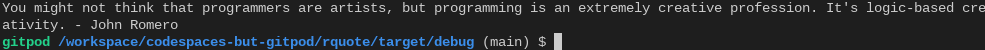

# rquote

A port of a project I did for HackClub Arcade, [cquote](https://github.com/OtterCodes101/cquote/), to Rust!
To compile, you just need to run `cargo build --release` in your shell. The binary will be in the `target/release` directory.
If you want to use your own quotes, use the `-f` flag to specify a quotes file. Every newline is interpreted as a different quote.
rquote also supports parsing fortune files. To parse a quotes file in fortune mode, use the `-F` flag.
